# Ejercicio 1 — Airflow + MinIO + Trino (con Polars)

Pipeline ETL que ingiere un CSV histórico de transacciones a un data lake en MinIO, lo limpia y agrega con **Polars**, lo materializa en **Parquet** y lo expone como tablas SQL en **Trino**.

## Arquitectura

```
data_prueba_tecnica.csv
(minio-init suelta el CSV en landing al levantar)
s3://bck-landing/data/data_prueba_tecnica.csv
Airflow DAG: etl_engineer_challenge

   s3://bck-bronze/master/data_prueba_tecnica.parquet      → bronze.prueba.tbl_data
   s3://bck-bronze/master_agg/tbl_data_agg.parquet         → bronze.prueba.tbl_data_agg
   s3://bck-bronze/quarantine/data_prueba_tecnica_quarantine.parquet  (Se crea para almacenar los datos con fallas)
```


## Cómo levantar el entorno

```bash
cd ejercicio1
docker compose up -d
# La primera vez tarda algunos minutos: Airflow instala Polars/Trino/s3fs vía _PIP_ADDITIONAL_REQUIREMENTS.


```

Evidencias del proceso del ejercicio:
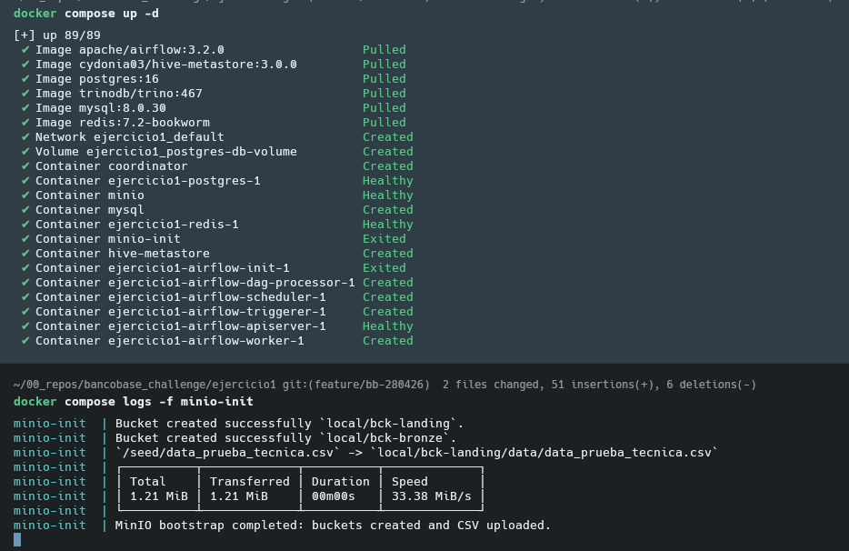

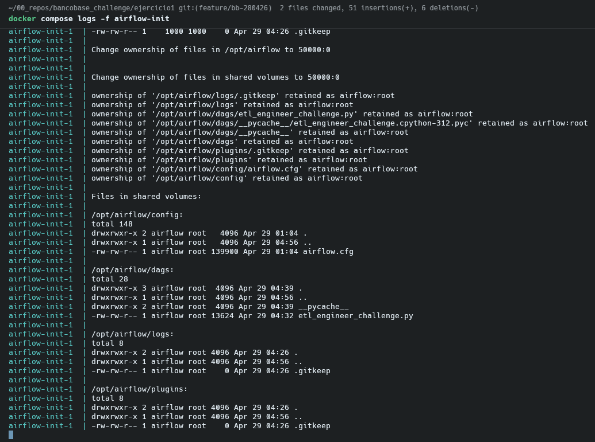

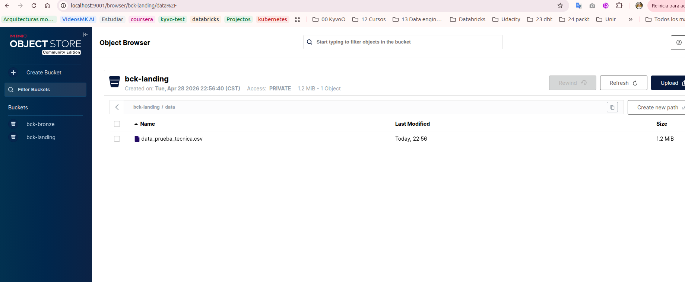

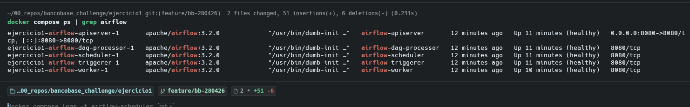

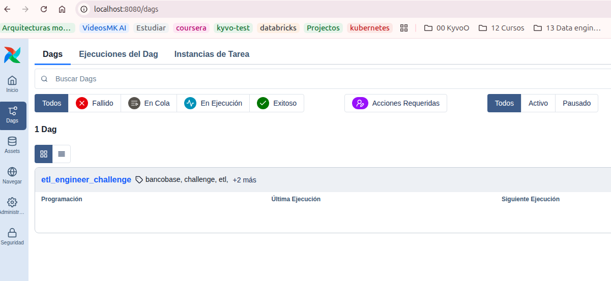

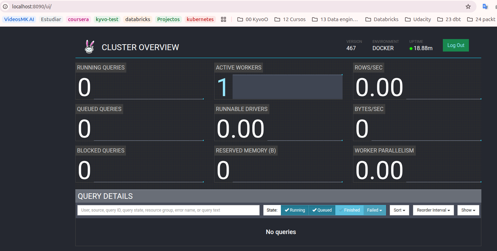

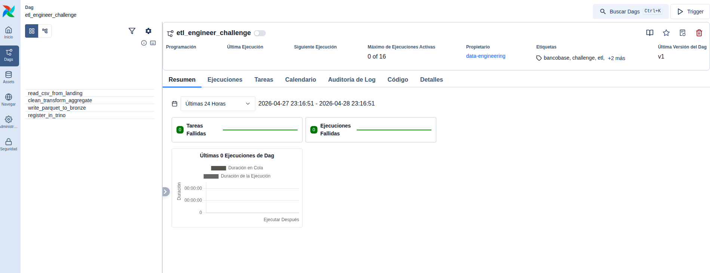

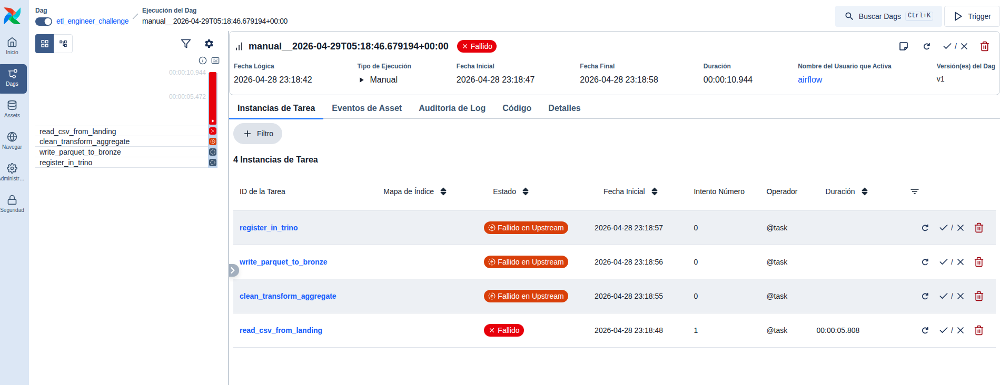

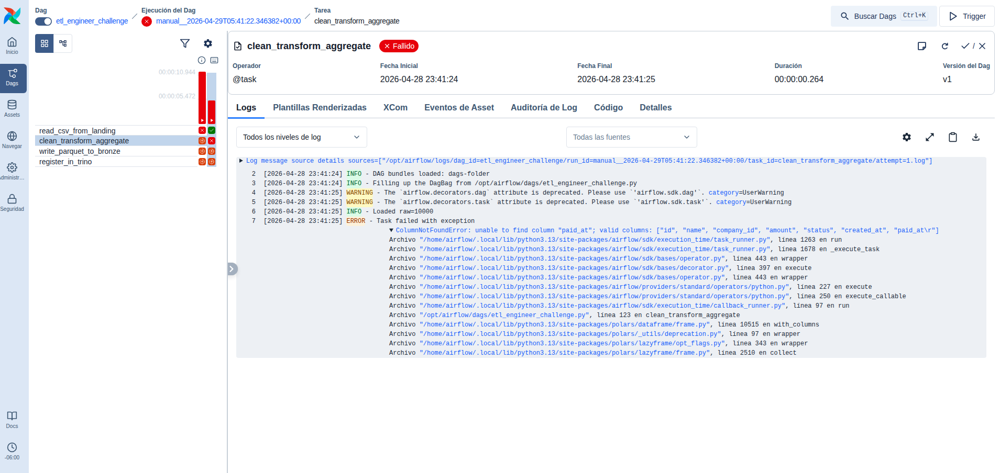

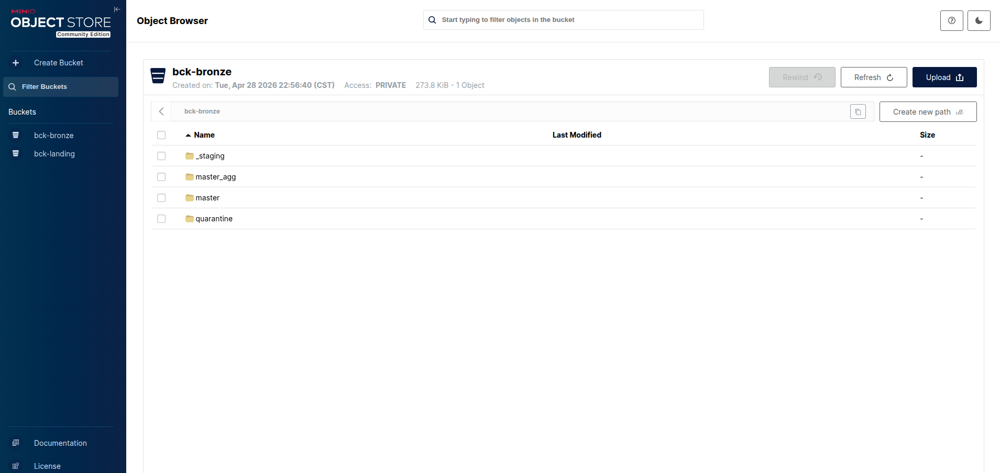

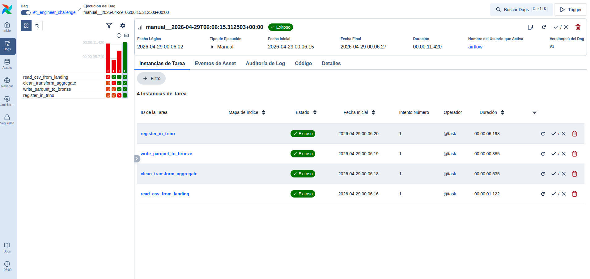

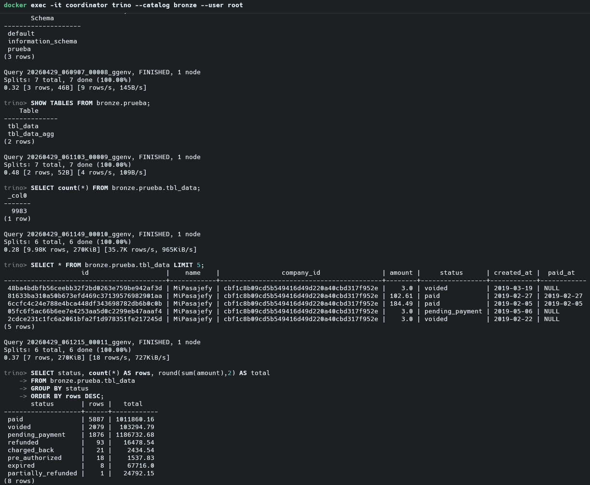

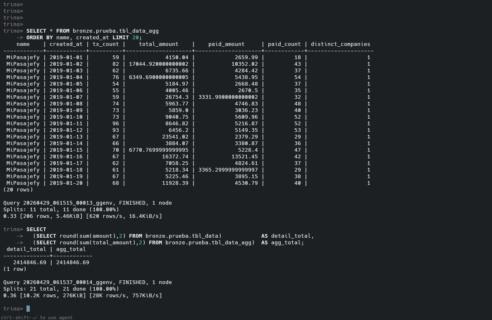

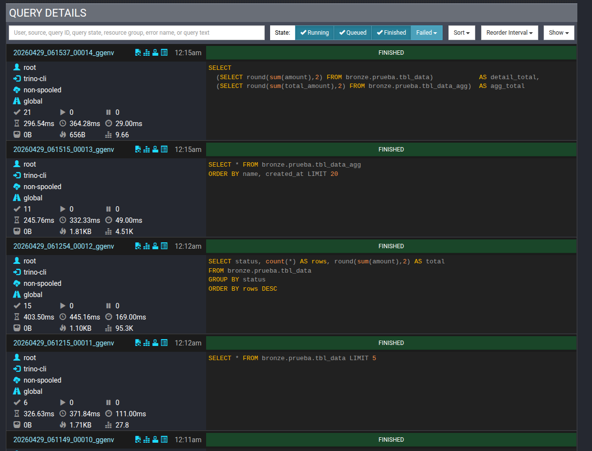


1. Verifica que MinIO - http://localhost:9001
2. Entra a Airflow: http://localhost:8080 (user/pass: `airflow` / `airflow`).
3. Verificar Trino http://localhost:8090 (no requiere password — user es root).
4. Activa y dispara el DAG `etl_engineer_challenge`
5. Validar en Trino las tablas creadas:

Primero: docker exec -it coordinator trino --catalog bronze --user root

```sql
-- Esquema y tablas
SHOW SCHEMAS FROM bronze;
SHOW TABLES FROM bronze.prueba;

-- Detalle limpio
SELECT count(*) FROM bronze.prueba.tbl_data;
SELECT * FROM bronze.prueba.tbl_data LIMIT 10;

-- Distribución por status
SELECT status, count(*) AS rows, sum(amount) AS total
FROM bronze.prueba.tbl_data
GROUP BY status
ORDER BY rows DESC;

-- Resumen agregado por (name, created_at)
SELECT * FROM bronze.prueba.tbl_data_agg ORDER BY name, created_at LIMIT 20;

-- Sanity: cuadre detalle vs agregado
SELECT
  (SELECT sum(amount) FROM bronze.prueba.tbl_data) AS detail_total,
  (SELECT sum(total_amount) FROM bronze.prueba.tbl_data_agg) AS agg_total;
```

## Importante

| # | Tema | Decisión | Razón |
|---|------|----------|-------|
| 1 | Limpieza | **Cuarentena** + imputación suave de `name` | Filas inválidas (id/company vacíos, status fuera de whitelist, amount no finito o > 1M, fecha imposible) se aíslan en `bck-bronze/quarantine/...parquet` con flags. Tokens `*0xFFFF*` en `name` se imputan a `MiPasajefy` (única corrupción detectable inequívocamente). |
| 2 | Agregaciones | Detalle + tabla resumen | `tbl_data` mantiene el grano transaccional; `tbl_data_agg` agrega por `(name, created_at)` con `tx_count`, `total_amount`, `paid_amount`, `paid_count`, `distinct_companies`. |
| 3 | Parquet | Archivo único por prefijo | `master/data_prueba_tecnica.parquet`, `master_agg/tbl_data_agg.parquet`. Trino apunta al **directorio**; cada uno contiene un solo archivo. |
| 4 | Procesamiento | Polars puro | Sin pandas en ningún paso. Ingreso/salida directa a S3 vía `storage_options` (object_store). |
| 5 | Conexiones | Vars de entorno | `AIRFLOW_CONN_MINIO_S3`, `AIRFLOW_CONN_TRINO_DEFAULT`, más `MINIO_*` y `TRINO_*` para uso directo en el DAG. Sin pasos manuales en la UI. |
| 6 | `.env` | A la raíz del compose | Para que `AIRFLOW_UID` se aplique. |
| 7 | Bootstrap MinIO | Servicio `minio-init` automático | Crea buckets `bck-landing`/`bck-bronze` y sube el CSV en cada `up`, idempotente. |
| 8 | Idempotencia | Overwrite total | Cada corrida sobreescribe los parquet; las DDL hacen `DROP TABLE IF EXISTS` + `CREATE`. |


## Limpieza aplicada

Reglas en [Airflow/dags/etl_engineer_challenge.py](Airflow/dags/etl_engineer_challenge.py):

- **`name`** que contiene `0xFFFF` → imputado a `MiPasajefy`.
- **`created_at` / `paid_at`** parseados con `coalesce` sobre formatos `%Y-%m-%d`, `%Y-%m-%dT%H:%M:%S`, `%Y%m%d`.
- **`amount`** casteado a `Float64` con `strict=False`. Filas con `null`, `+inf` (overflow) o fuera de `[0, 1_000_000]` → cuarentena.
- **`status`** validado contra whitelist de 8 estados conocidos. Tokens basura (`0xFFFF`, `p&0x3fid`) → cuarentena.
- **`paid_at`** vacío sólo se permite cuando `status` ∉ {`paid`, `refunded`, `partially_refunded`}.
- **Dedup** sobre `id` (keep first).

## Estructura del repo

```
ejercicio1/
├── .env                              # AIRFLOW_UID/GID
├── docker-compose.yaml
├── data_prueba_tecnica.csv           # CSV de entrada (montado en minio-init)
├── README.md
├── notas.txt
├── Airflow/
│   ├── config/airflow.cfg
│   ├── dags/etl_engineer_challenge.py
│   ├── plugins/
│   └── logs/
├── Minio/
│   └── data/                         # Volumen persistente del object store
├── Hive/
│   └── metastore-site.xml
└── Trino/
    └── etc/
        ├── config.properties
        └── catalog/bronze.properties
```

## Apagar y limpiar

```bash
docker compose down                # detiene servicios, conserva datos en volúmenes
docker compose down -v             # ELIMINA datos (Postgres metadata + MinIO)
sudo rm -rf Minio/data Airflow/logs # opcional: limpieza de volúmenes bind
```


Síntoma	                    Comando
minio-init no termina:	    docker compose logs minio-init
Airflow UI no carga:	      docker compose logs airflow-apiserver | tail -100
Worker no procesa tasks:	  docker compose logs airflow-worker | tail -100
Trino DDL falla:	          docker compose logs trino | tail -100 y docker compose logs hive-metastore | tail -100
Polars no encuentra el CSV:	Verifica el bucket en MinIO (paso 2) y que MINIO_ENDPOINT=http://minio:9000 aparezca en docker compose exec airflow-worker env | grep MINIO