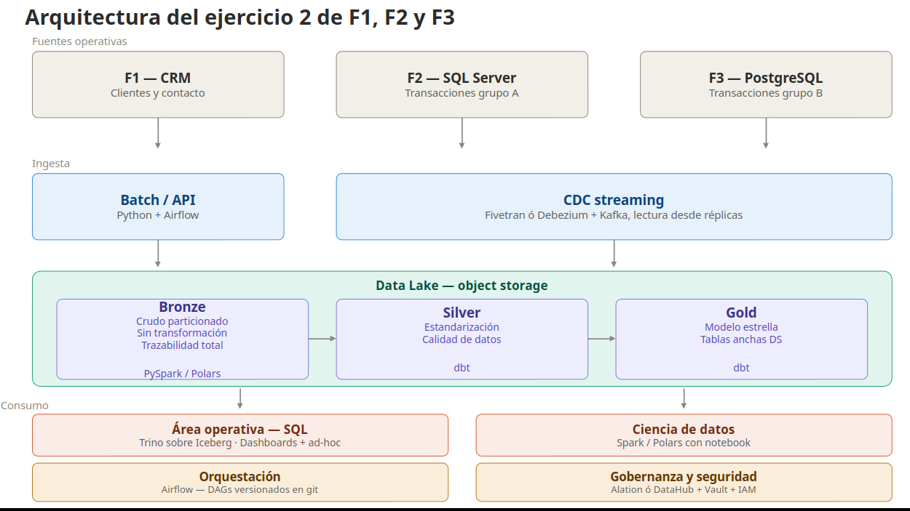

Ejercicio 2

La idea es no traerse todo. Cada fuente tiene su rol y eso ya nos dice que campos pesan.
Del (CRM) me llevaría los datos que identifican y describen al cliente: id_cliente, nombre, documento, fecha de nacimiento, género. Importante tambien fecha de alta y fecha de última actualización es clave porque me va a servir para hacer extracción incremental despues.
De las fuentes transaccionales me llevaría lo minimo que describe la transaccion, por ejemplo: id_transaccion, id_cliente para cruzar con el CRM, id_producto, monto, moneda, fecha de la transacción, fecha demodificacion del registro. La idea para pensar que campos traer debe responder a si ese campo da respuesta a una pregunta de negocio.

Las herramientas que usaria seria Fivetran pues resuelve las tres fuentes para extraer aunque esto implica un costo. Otras manera seria para las fuentes transaccionales Debezium + kafka y para el CRM un flujo batch en airflow.

En cuanto a las transaccionales el reto es no pegarle a la transaccional en hora pico. Lo ideal es leer de una réplica. Y para el CRM es que no siempre te dan acceso limpio a la BD a veces tedan acceso a una API o a un export progrmado. Otro inconveniente es que te dan es el manejo de esquemas cambiante.

Para el reto de la independencia de modelos y como resolver.
Mi forma de resolverlo es con una arquitectura por capas (medallion: bronze, silver,gold). En bronze guardo tal cual viene, en silver estandarizo nombres, tipos y resuelvo identidades, y en gold modelo para el consumo final (estrella para los de SQL, vistas más planas para data science).
El reto es que tenemos que armar una tabla de mapeo para unificar a los clientes que vienen con IDs distintos mediante llaves naturales y reglas de match, porque cada sistema va por su cuenta. Hay que estandarizar el lenguaje con un diccionario de datos para no confundir terminos como amount con monto, limpiar  formatos de fechas y decimales para que sean consistentes, y nivelar la granularidad de las tablas para que todas hablen al mismo nivel de detalle. Básicamente, se trata de montar una capa y transformacion que resuelva la inconsistencia de los catalogos y las equivalencias, dejando todo documentado para que el modelo final sea funcional y no dependa de cada sistema.

D. ¿Cómo mitigo el impacto sobre las fuentes aparte del batch nocturno?
Leer de réplicas, no del primario, extracción incremental, solo lo que cambio desde la ultima corrida. 

E. Etapas del proceso de transformacion
Las etapas del patrón medallion:
Landing / Raw. El dato cae tal cual sale de la fuente, sin tocarse. formato original o parquet crudo. Sirve para reproducibilidad.
Bronze. Mismo dato pero ya en formato columnar (parquet), particionado por fecha de ingesta, con metadata de cuando y de donde vino. Sin transformaciones de negocio todavía.
Silver. Aca pasa lo interesante: estandarización de nombres, tipos y formatos; deduplicación; identity resolution para unificar el cliente entre F1, F2 y F3; aplicación de catálogos y lookups; validaciones de calidad (nulos esperados, rangos, integridad referencial). El resultado es un modelo conformado y limpio, pero todavía cercano al detalle.
Gold. Modelado para consumo. Aca divido segun el proposito:

Para el área operativa (SQL): un modelo estrella o snowflake con tablas de hechos (transacciones unificadas) y dimensiones (cliente, producto, tiempo).
Para ciencia de datos: tablas más anchas y desnormalizadas, o features pre-calculadas.

F. Herramientas para transformación
dbt para todo lo que sea transformación SQL desde silver hacia gold. Es lo más cómodo para que las reglas de negocio queden versionadas, testeadas y documentadas.
Spark (PySpark) o Polars para las transformaciones pesadas de bronze → silver, sobre todo identity resolution y joins grandes entre fuentes.
Explorar con Soda para tests de calidad de datos en cada capa. 

H. Orquestacion
Airflow como orquestador principal:
Es el estándar.
Maneja bien las dependencias entre tasks.
Tiene buenos providers para casi todo.

G. Storage por propósito.

La idea es un solo lake como fuente de la verdad y distintos motores de consulta encima según el caso de uso esto evita el clásico problema de tener copias.

Data Lake en object storage (S3 o cloud storage). Es la base de todo. Bronze y silver estaran acá. 
Para el área operativa: dos opciones. Si quieren consultar directo sobre el lake, Trino o Athena. Si necesitan dashboards, un data warehouse tipo BigQuery, Snowflake.
Para ciencia de datos: que lean directo del lake (silver y gold) con Spark o Polars desde sus notebooks.

