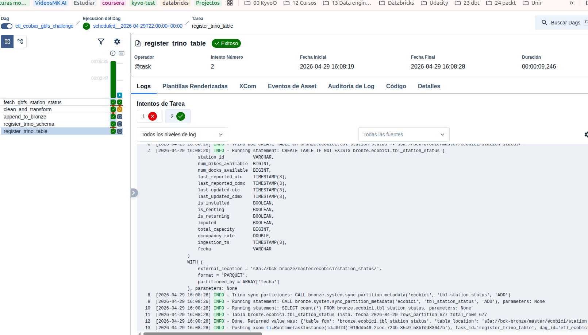
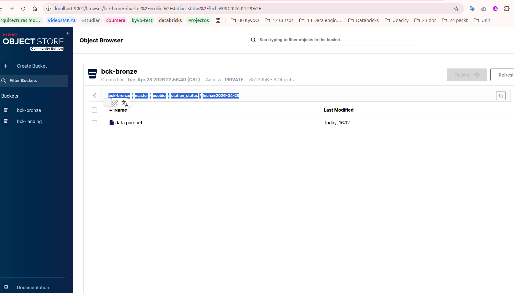
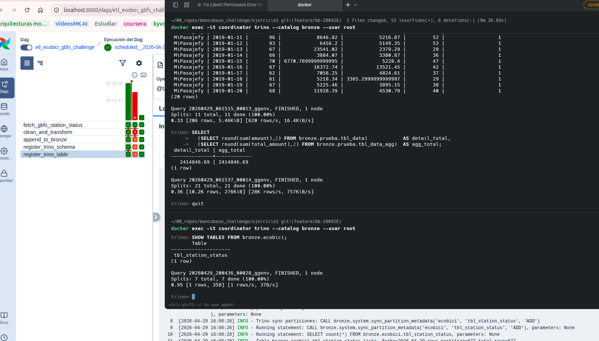
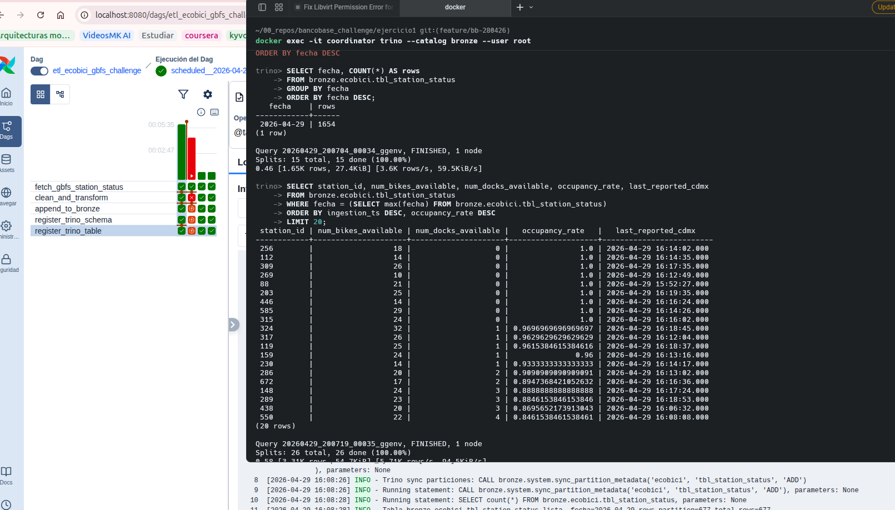

¿Qué dataset se seleccionó para tu flujo? 
    station_status

¿Qué temporalidad se realizará la extracción? Explica por qué se seleccionó este timing.
     La cadencia que escogi fue de 10 min esto es suficiente para análisis de patrones de uso sin saturar a la API ni a MinIO.

¿Qué limpieza de datos usaste o crees que necesitaba los datos?
    filas sin station_id se descartan; nulos en num_bikes_available o num_docks_available se igualan a 0 con flag imputed = True
    Deduplicación dentro del snapshot: por station_id quedándonos con el last_reported más reciente.
    is_installed, is_renting, is_returning se castean a bool real (vienen como 0/1)

¿Qué propuesta de partición de ruta elegiste para el guardado de tu parquet y crees que esta partición afecta a Trino para su disponibilización automática de datos?

    Partición: por fecha
    Path: bck-bronze/master/ecobici/station_status/fecha=YYYY-MM-DD/data.parquet

¿De todo el proceso, cuál fue el reto más grande? Explica el por qué.
    La logica de append y un solo parquet
    La deduplicacion
    Mapear los campos de polars a trino al crear la tabla

